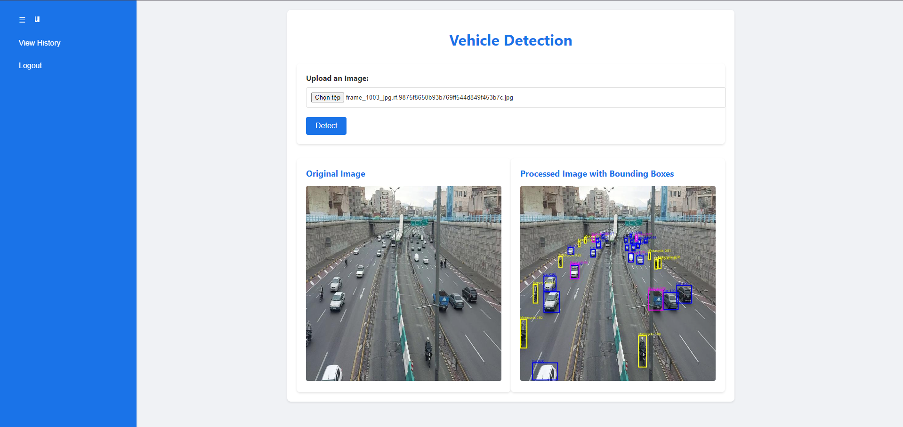

# Vehicle Detection API

This project is a FastAPI-based web application for vehicle detection in images. It uses a pre-trained Faster R-CNN model to detect various types of vehicles and provides a web interface for uploading images and viewing detection results.

## Table of Contents

✅ [Overview](#Overview)  
✅ [building model](#building-model)  
✅ [Technologies Used](#Technologies-Used)  
✅ [Installation](#Installation)  
✅ [Configuration](#Configuration)  
✅ [Usage](#Usage)  
✅ [API Endpoints](#API-Endpoints)  
✅ [Contributing](#Contributing)  

## building model 

- This model using the Faster R-CNN architecture with a ResNet-50 backbone. The model is trained to detect and classify vehicles in images.
- You can refer to how to build this model [here](https://github.com/OtaTran241/VehiclesDetection_FasterRCNN)

## Overview



## Technologies Used
```FastAPI```: FastAPI is the main framework used to build the application's API. It provides endpoints for user registration, login, image upload, and vehicle detection result retrieval.  
```SQLAlchemy```: SQLAlchemy is used to interact with the database. It manages data models such as User and DetectionResult, and provides sessions for database operations.  
```Pydantic```: Pydantic is used for data validation and management of input and output data for the API. It ensures that the data sent to and received from the API adheres to defined structures.  
```Celery```: Celery is used for asynchronous task processing, such as vehicle detection in images. This helps offload work from the main server and improves the application's performance.  
```Redis```: Redis is used as a task queue for Celery. It stores tasks that need to be processed and manages their states.  
```Uvicorn```:Uvicorn is an ASGI server used to run the FastAPI application. It provides a high-performance environment for handling HTTP requests.  
```Pillow```: Pillow is an image processing library used to open, process, and save images during the vehicle detection process.  
```PyTorch```: PyTorch is used to load and run the vehicle detection model (Faster R-CNN). It provides the necessary tools for tensor computations and model inference.  
```Jinja2```: Jinja2 is used to render HTML templates for the application's web pages, such as the login page, image upload page, and history page.  

## Installation
### Build and start with pip

1. Clone the repository:

    ```bash
    git clone https://github.com/yourusername/Vehicle_Detection_WebAPI.git
    cd Vehicle_Detection_WebAPI
    ```

2. Create and activate a virtual environment:

    ```bash
    python -m venv venv
    source venv/bin/activate  # On Windows use `venv\Scripts\activate`
    ```

3. Install the required packages:

    ```bash
    pip install -r requirements.txt
    ```

4. Start Redis:

    ```bash
    # On Linux or macOS
    redis-server

    # On Windows, you can use the following command if you have installed Redis using Chocolatey
    redis-server --service-start
    ```

5. Start the Celery worker:

    ```bash
    celery -A celery_tasks.tasks worker --pool=threads -l info
    ```

6. Start the FastAPI application:

    ```bash
    uvicorn app.main:app --host 0.0.0.0 --port 8000
    ```
### Build and start with Docker
1. Clone the repository:

    ```bash
    git clone https://github.com/yourusername/Vehicle_Detection_WebAPI.git
    cd Vehicle_Detection_WebAPI
    ```

2. Build and start the Docker containers:

    ```bash
    docker-compose up --build
    ```

3. The application will be available at `http://localhost:8000`.

## Configuration

The application configuration is defined in the `app/core/config.py` file. You can modify the configuration values directly in this file.

### Example Configuration
```python
class Settings:
    SERVER: str = 'test-db.c1aekiaskevm.ap-southeast-1.rds.amazonaws.com'
    USERNAME: str = 'testadmin'
    PASSWORD: str = 'testpw'
    DATABASE_NAME: str = 'testdb'
    DATABASE_URL: str = f"mssql+pymssql://{USERNAME}:{PASSWORD}@{SERVER}/{DATABASE_NAME}"
    SECRET_KEY: str = "your_secret_key"
    TEMP_DIR: str = "/app/temp"
    CELERY_BROKER_URL: str = "redis://redis:6379/0"
    CELERY_RESULT_BACKEND: str = "redis://redis:6379/0"
settings = Settings()
```

## Usage

### Register a New User

1. Open your browser and navigate to `http://localhost:8000/register`.
2. Fill in the registration form and submit.

### Login

1. Open your browser and navigate to `http://localhost:8000/login`.
2. Fill in the login form and submit.
3. The access token will be stored in the browser's local storage.

### Upload an Image for Detection

1. Open your browser and navigate to `http://localhost:8000`.
2. Upload an image and click the "Detect" button.
3. The original and processed images will be displayed.

### View Detection History

1. Open your browser and navigate to `http://localhost:8000/history`.
2. The detection history will be displayed.

## API Endpoints

### Register

- **URL:** `/register`
- **Method:** `POST`
- **Request Body:**
  ```json
  {
    "username": "string",
    "password": "string",
    "email": "string"
  }
  ```
- **Response:**
  ```json
  {
    "message": "User registered successfully"
  }
  ```

### Login

- **URL:** `/token`
- **Method:** `POST`
- **Request Body:**
  ```json
  {
    "username": "string",
    "password": "string"
  }
  ```
- **Response:**
  ```json
  {
    "access_token": "string",
    "token_type": "bearer"
  }
  ```

### Detect

- **URL:** `/detect`
- **Method:** `POST`
- **Request Body:**
  - `file`: Image file
- **Response:**
  ```json
  {
    "task_id": "string",
    "original_image_url": "string",
    "output_image_url": "string",
    "status": "string"
  }
  ```

### Get Predictions

- **URL:** `/predictions`
- **Method:** `GET`
- **Response:**
  ```json
  [
    {
      "result_id": "int",
      "task_id": "string",
      "original_image_path": "string",
      "processed_image_path": "string",
      "status": "string",
      "predicted_at": "datetime",
      "user_id": "int"
    }
  ]
  ```

## Contributing
Contributions are welcome! If you have any ideas for improving the model or adding new features, feel free to submit a pull request or send an email to [tranducthuan220401@gmail.com](mailto:tranducthuan220401@gmail.com).
